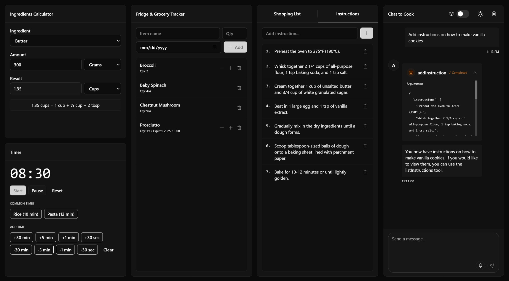

# 🥘 CookCalc



<a href="https://deploy.workers.cloudflare.com/?url=https://github.com/leeeweee1710/cf_ai_cookcalc"></a>

A smart cooking calculator using Cloudflare's Agent platform, based on [`agents-starter`](https://github.com/cloudflare/agents-starter). An instance is deployed [here](https://cookcalc.leeeweee.workers.dev/).

## Features

- 💬 Interactive chat with voice input
- 🛠️ AI can interact with the tools directly
- 🔄 Sync state (shopping list, timer, etc.) and chat history in real time just by sharing URL

## Prerequisites

- Cloudflare account

## Quick Start

1. Create a new project:

```bash
npx create-cloudflare@latest --template leeeweee1710/cf_ai_cookcalc
```

2. Install dependencies:

```bash
npm install
```

3. Run locally:

```bash
npm start
```

4. Deploy:

```bash
npm run deploy
```

## Project Structure

```
├── src/
│   ├── app.tsx        # Chat UI implementation
│   ├── server.ts      # Chat agent logic
│   ├── tools.ts       # Tool definitions
│   ├── utils.ts       # Helper functions
│   └── styles.css     # UI styling
```

## License

MIT
